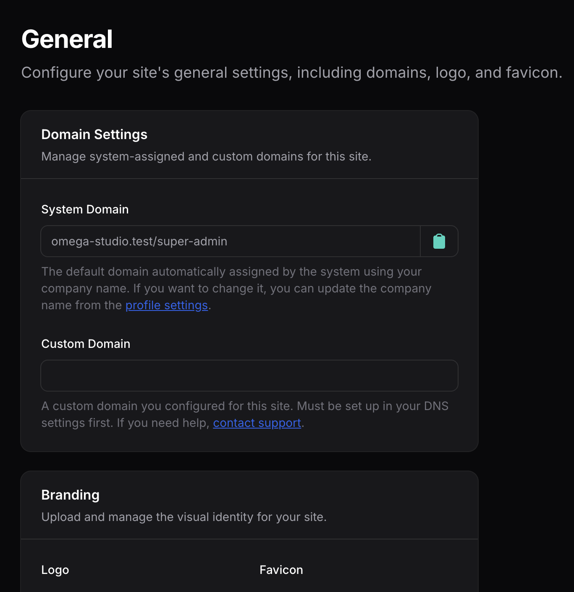

# Filament Dynamic Settings


Centralized dynamic settings system for Filament with enum-driven setting management.



## Installation

Install the package via composer:

```bash
composer require ferarandrei1/filament-dynamic-settings
```

Publish the migration file:

```bash
php artisan vendor:publish --tag=filament-dynamic-settings-migrations
```

Run the migrations:

```bash
php artisan migrate
```

## Quick Start

The package automatically registers two settings pages in your Filament panel:

1. **General Settings** - Manage domain settings, logo, and favicon
2. **Homepage Settings** - Configure homepage content, social media links, and contact information

### Basic Usage

```php
use Feraandrei1\FilamentDynamicSettings\Models\Setting;
use Illuminate\Support\Facades\Auth;

// Create or update a setting
Setting::updateOrCreate(
    [
        'uploaded_by_user_id' => Auth::id(),
        'group' => 'general',
        'name' => 'logo',
    ],
    ['payload' => $logoData]
);

// Retrieve settings
$settings = Setting::where('uploaded_by_user_id', Auth::id())
    ->where('group', 'general')
    ->get()
    ->keyBy('name');

$logo = $settings['logo']->payload ?? null;
```

## Documentation

Learn how to use and extend the package:

- **[Using Enums for Type-Safe Settings](docs/enums-usage.md)** - Learn how to use enums for type-safe setting management and how to extend them for your custom settings.

- **[Creating Custom Settings Pages](docs/filament-pages-usage.md)** - Learn how to create custom Filament settings pages or customize the built-in ones.

## Features

- Enum-driven setting names and groups for type safety
- Built-in Filament pages for General and Homepage settings
- Database-backed settings storage with user-specific support
- No third-party dependencies
- Easy to extend and customize

## Requirements

- PHP 8.1 or higher
- Filament 3.0 or higher
- Laravel 10.0 or higher

## License

MIT License
